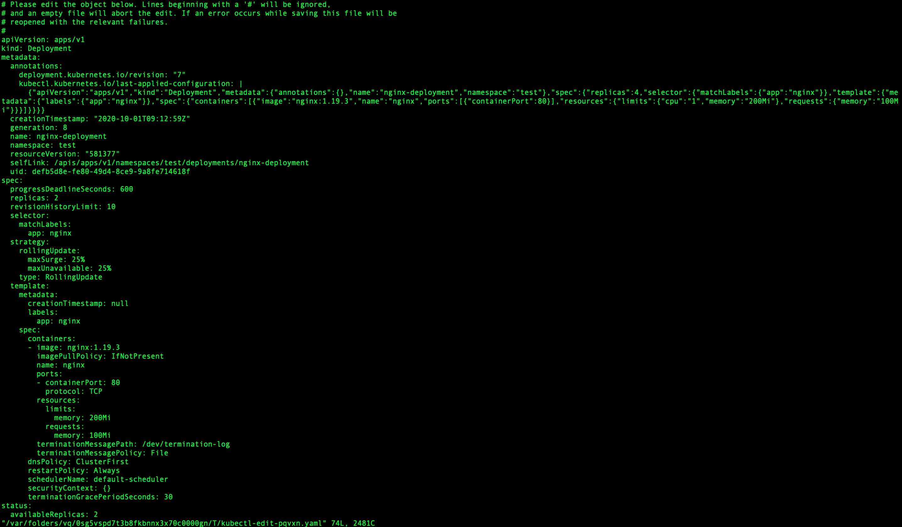
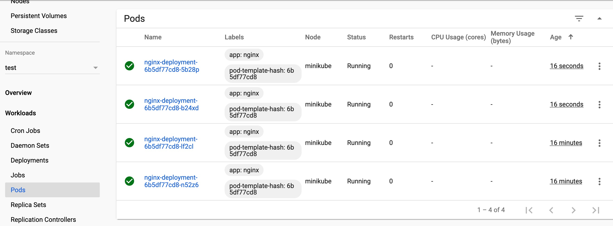
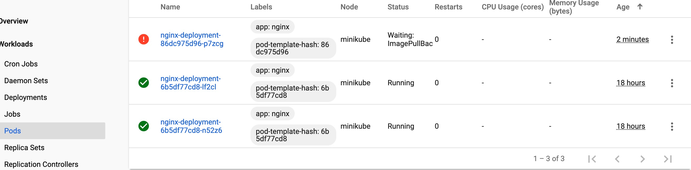

# 一拳搞定 Kubernetes | 玩转 deployment

本文介绍通过 Kubernetes Deployment 对象如何去控制一个应用。

<!--more-->

## 一、前言

学习目标:
- 创建一个 nginx deployment。
- 使用 kubectl 对 deployment 进行 CRUD。（结合 dashboard 图示）
- 使用 go 客户端进行上述操作。

> 默认已经安装了 kubernetes。如果没安装，请参考搭建 [minikube]()

## 二、实战操作

### 2.1 准备 yaml 文件

按照任务创建一个运行 nginx:1.14.2 Docker 镜像的 Deployment:

```yaml
apiVersion: apps/v1 # for versions before 1.9.0 use apps/v1beta2
kind: Deployment
metadata:
  name: nginx-deployment
  namespace: test
spec:
  selector:
    matchLabels:
      app: nginx
  replicas: 2 # tells deployment to run 2 pods matching the template
  template:
    metadata:
      labels:
        app: nginx
    spec:
      containers:
      - name: nginx
        image: nginx:1.14.2
        ports:
        - containerPort: 80
```

文件说明：

- 在命名空间 test（由 .metadata.namespace 字段标明）创建名为 nginx-deployment（由 .metadata.name 字段标明）的 Deployment。
- 该 Deployment 创建两个（由 .spec.replicas 字段标明）Pod 副本。
- selector 字段定义 Deployment 如何查找要管理的 Pods。 在这里，你只需选择在 Pod 模板中定义的标签（app: nginx）。 不过，更复杂的选择规则是也可能的，只要 Pod 模板本身满足所给规则即可。



matchLabels 字段是 {key,value} 偶对的映射。在 matchLabels 映射中的单个 {key,value} 映射等效于 matchExpressions 中的一个元素，即其 key 字段是 “key”，operator 为 “In”，value 数组仅包含 “value”。在 matchLabels 和 matchExpressions 中给出的所有条件都必须满足才能匹配。



- template 字段包含以下子字段：
  - Pod 被使用 labels 字段打上 app: nginx 标签。
  - Pod 模板规约（即 .template.spec 字段）指示 Pods 运行一个 nginx 容器， 该容器运行版本为 1.14.2 的 nginx Docker Hub镜像。
  - 创建一个容器并使用 name 字段将其命名为 nginx。

### 2.2 创建 Deployment

#### 1. 运行 yaml 文件创建

> 也可以通过命令直接创建，参考[minikube]()

```bash
kubectl apply -f /XXX/document/note/Kubernetes/test/nginx/deployment.yaml
```



说明： 你可以设置 --record 标志将所执行的命令写入资源注解 kubernetes.io/change-cause 中。 这对于以后的检查是有用的。例如，要查看针对每个 Deployment 修订版本所执行过的命令。



#### 2. 查看 deployment 创建情况

```bash
kubectl get deployments --namespace=test
```

输出：

```bash
NAME               READY   UP-TO-DATE   AVAILABLE   AGE
nginx-deployment   2/2     2            2           8d
```

输出字段说明：

- NAME 列出了集群中 Deployment 的名称。
- READY 显示应用程序的可用的 副本 数。显示的模式是“就绪个数/期望个数”。
- UP-TO-DATE 显示为了达到期望状态已经更新的副本数。
- AVAILABLE 显示应用可供用户使用的副本数。
- AGE 显示应用程序运行的时间。

#### 3. 查看 Deployment 上线状态：

```bash
kubectl rollout status deployment.v1.apps/nginx-deployment --namespace=test
```

输出：

```bash
deployment "nginx-deployment" successfully rolled out
```

#### 4. 查看 Deployment 创建的 ReplicaSet（rs）：

```bash
kubectl get rs --namespace=test
```

输出：

```bash
NAME                          DESIRED   CURRENT   READY   AGE
nginx-deployment-6b5df77cd8   2         2         2       17h
nginx-deployment-74f5bf7bd9   0         0         0       8d
nginx-deployment-7c79566d49   0         0         0       17h
nginx-deployment-865d6c94c9   0         0         0       17h
nginx-deployment-fbb99c8b8    0         0         0       17h
```

输出字段说明：

- NAME 列出名字空间中 ReplicaSet 的名称；
- DESIRED 显示应用的期望副本个数，即在创建 Deployment 时所定义的值。 此为期望状态；
- CURRENT 显示当前运行状态中的副本个数；
- READY 显示应用中有多少副本可以为用户提供服务；
- AGE 显示应用已经运行的时间长度。

#### 5. 展示 Deployment 的更多信息：

```bash
kubectl describe deployment nginx-deployment --namespace=test
```

输出：

```bash
Name:                   nginx-deployment
Namespace:              test
CreationTimestamp:      Thu, 01 Oct 2020 17:12:59 +0800
Labels:                 <none>
Annotations:            deployment.kubernetes.io/revision: 3
                        kubectl.kubernetes.io/last-applied-configuration:
                          {"apiVersion":"apps/v1","kind":"Deployment","metadata":{"annotations":{},"name":"nginx-deployment","namespace":"test"},"spec":{"replicas":...
Selector:               app=nginx
Replicas:               2 desired | 2 updated | 2 total | 2 available | 0 unavailable
StrategyType:           RollingUpdate
MinReadySeconds:        0
RollingUpdateStrategy:  25% max unavailable, 25% max surge
Pod Template:
  Labels:  app=nginx
  Containers:
   nginx:
    Image:      nginx:1.14.2
    Port:       80/TCP
    Host Port:  0/TCP
    Limits:
      memory:  200Mi
    Requests:
      memory:     100Mi
    Environment:  <none>
    Mounts:       <none>
  Volumes:        <none>
Conditions:
  Type           Status  Reason
  ----           ------  ------
  Available      True    MinimumReplicasAvailable
  Progressing    True    NewReplicaSetAvailable
OldReplicaSets:  <none>
NewReplicaSet:   nginx-deployment-fbb99c8b8 (2/2 replicas created)
Events:
  Type    Reason             Age    From                   Message
  ----    ------             ----   ----                   -------
  Normal  ScalingReplicaSet  5m6s   deployment-controller  Scaled up replica set nginx-deployment-865d6c94c9 to 1
  Normal  ScalingReplicaSet  3m43s  deployment-controller  Scaled down replica set nginx-deployment-74f5bf7bd9 to 1
  Normal  ScalingReplicaSet  3m43s  deployment-controller  Scaled up replica set nginx-deployment-fbb99c8b8 to 1
  Normal  ScalingReplicaSet  3m41s  deployment-controller  Scaled down replica set nginx-deployment-865d6c94c9 to 0
  Normal  ScalingReplicaSet  3m41s  deployment-controller  Scaled up replica set nginx-deployment-fbb99c8b8 to 2
  Normal  ScalingReplicaSet  3m38s  deployment-controller  Scaled down replica set nginx-deployment-74f5bf7bd9 to 0
```

输出字段说明：

- Events rs 根据 deployment 的配置控制 pod 的行为，可以看到当副本数变化时，旧的 rs 缩容到 0，新的 rs 扩容到 2（是从上往下的顺序执行，渐进式，结合下一个小贴士便于理解）。

#### 6. 列出创建的 pods：

```bash
kubectl get pods -l app=nginx --namespace=test
```

输出：

```bash
NAME                               READY   STATUS    RESTARTS   AGE
nginx-deployment-fbb99c8b8-4lpwd   1/1     Running   0          5m28s
nginx-deployment-fbb99c8b8-tpd4n   1/1     Running   0          5m26s
```



Deployment 可确保在更新时仅关闭一定数量的 Pod。默认情况下，它确保至少所需 Pods 75% 处于运行状态（最大不可用比例为 25%）。

Deployment 还确保仅所创建 Pod 数量只可能比期望 Pods 数高一点点。 默认情况下，它可确保启动的 Pod 个数比期望个数最多多出 25%（最大峰值 25%）。



#### 7. 查看具体某个 pod 的信息：

```bash
kubectl describe pod nginx-deployment-fbb99c8b8-4lpwd --namespace=test
```

输出：

```bash
Name:         nginx-deployment-fbb99c8b8-4lpwd
Namespace:    test
Priority:     0
Node:         minikube/192.168.64.3
Start Time:   Fri, 09 Oct 2020 15:40:15 +0800
Labels:       app=nginx
              pod-template-hash=fbb99c8b8
Annotations:  <none>
Status:       Running
IP:           172.17.0.9
IPs:
  IP:           172.17.0.9
Controlled By:  ReplicaSet/nginx-deployment-fbb99c8b8
Containers:
  nginx:
    Container ID:   docker://16da80166234e8f7fdbb2e2bb7accbcc1841213cb2888af6463102675414c00d
    Image:          nginx:1.14.2
    Image ID:       docker-pullable://nginx@sha256:f7988fb6c02e0ce69257d9bd9cf37ae20a60f1df7563c3a2a6abe24160306b8d
    Port:           80/TCP
    Host Port:      0/TCP
    State:          Running
      Started:      Fri, 09 Oct 2020 15:40:16 +0800
    Ready:          True
    Restart Count:  0
    Limits:
      memory:  200Mi
    Requests:
      memory:     100Mi
    Environment:  <none>
    Mounts:
      /var/run/secrets/kubernetes.io/serviceaccount from default-token-pvdh5 (ro)
Conditions:
  Type              Status
  Initialized       True
  Ready             True
  ContainersReady   True
  PodScheduled      True
Volumes:
  default-token-pvdh5:
    Type:        Secret (a volume populated by a Secret)
    SecretName:  default-token-pvdh5
    Optional:    false
QoS Class:       Burstable
Node-Selectors:  <none>
Tolerations:     node.kubernetes.io/not-ready:NoExecute for 300s
                 node.kubernetes.io/unreachable:NoExecute for 300s
Events:
  Type    Reason     Age        From               Message
  ----    ------     ----       ----               -------
  Normal  Scheduled  <unknown>  default-scheduler  Successfully assigned test/nginx-deployment-fbb99c8b8-4lpwd to minikube
  Normal  Pulled     6m31s      kubelet, minikube  Container image "nginx:1.14.2" already present on machine
  Normal  Created    6m31s      kubelet, minikube  Created container nginx
  Normal  Started    6m31s      kubelet, minikube  Started container nginx
```



千万别修改。

Deployment 控制器将 pod-template-hash 标签添加到 Deployment 所创建或收留的 每个 ReplicaSet 。

此标签可确保 Deployment 的子 ReplicaSets 不重叠。 标签是通过对 ReplicaSet 的 PodTemplate 进行哈希处理。 所生成的哈希值被添加到 ReplicaSet 选择算符、Pod 模板标签，并存在于在 ReplicaSet 可能拥有的任何现有 Pod 中。



#### 8. 查看 ReplicaSet（rs）的更多信息

```bash
kubectl describe rs nginx-deployment-6b5df77cd8 --namespace=test
```

输出：

```bash
Name:           nginx-deployment-6b5df77cd8
Namespace:      test
Selector:       app=nginx,pod-template-hash=6b5df77cd8
Labels:         app=nginx
                pod-template-hash=6b5df77cd8
Annotations:    deployment.kubernetes.io/desired-replicas: 2
                deployment.kubernetes.io/max-replicas: 3
                deployment.kubernetes.io/revision: 7
                deployment.kubernetes.io/revision-history: 5
Controlled By:  Deployment/nginx-deployment
Replicas:       2 current / 2 desired
Pods Status:    2 Running / 0 Waiting / 0 Succeeded / 0 Failed
Pod Template:
  Labels:  app=nginx
           pod-template-hash=6b5df77cd8
  Containers:
   nginx:
    Image:      nginx:1.19.3
    Port:       80/TCP
    Host Port:  0/TCP
    Limits:
      memory:  200Mi
    Requests:
      memory:     100Mi
    Environment:  <none>
    Mounts:       <none>
  Volumes:        <none>
Events:           <none>
```

主要是 selector 和 labels 加了 pod-template-hash 值，和上文 pod 中提到的 pod-template-hash 对应。

### 2.3 更新 deployment

更新镜像，把 nginx 从 1.14.2 升级到 1.19.3

#### 1. 直接修改配置文件

```yaml
apiVersion: apps/v1 # for versions before 1.9.0 use apps/v1beta2
kind: Deployment
metadata:
  name: nginx-deployment
  namespace: test
spec:
  selector:
    matchLabels:
      app: nginx
  replicas: 2 # tells deployment to run 2 pods matching the template
  template:
    metadata:
      labels:
        app: nginx
    spec:
      containers:
      - name: nginx
        image: nginx:1.19.3
        ports:
        - containerPort: 80
```

再次执行 `kubectl apply -f` 指令。

#### 2. 执行 kubectl 编辑命令

```bash
kubectl --record deployment.apps/nginx-deployment set image \
   deployment.v1.apps/nginx-deployment nginx=nginx:1.19.3 --namespace=test
```

或者

```bash
kubectl set image deployment/nginx-deployment nginx=nginx:1.19.3 --record --namespace=test
```

或者

```bash
kubectl edit deployment.v1.apps/nginx-deployment --namespace=test

# 等价

kubectl edit deployment/nginx-deployment --namespace=test
```

编辑效果：



查看新的 pods:

```bash
kubectl get pods -l app=nginx --namespace=test

NAME                                READY   STATUS    RESTARTS   AGE
nginx-deployment-6b5df77cd8-lf2cl   1/1     Running   0          69s
nginx-deployment-6b5df77cd8-n52z6   1/1     Running   0          71s
```

可以看到和之前的名称都是不一样的。

dashboard可以直观看到:



### 2.4 删除 deployment

通过名称删除deployment:

```bash
kubectl delete deployment nginx-deployment --namespace=test
```

### 2.5 改变副本数来弹性伸缩应用

关键参数 `replicas` 可以设置 pod 的数量，下面例子把 nginx 变成 4 个。

#### 1. 直接修改配置文件

```yaml
apiVersion: apps/v1 # for versions before 1.9.0 use apps/v1beta2
kind: Deployment
metadata:
  name: nginx-deployment
  namespace: test
spec:
  selector:
    matchLabels:
      app: nginx
  replicas: 4 # tells deployment to run 2 pods matching the template
  template:
    metadata:
      labels:
        app: nginx
    spec:
      containers:
      - name: nginx
        image: nginx:1.19.3
        ports:
        - containerPort: 80
```

再次执行 `kubectl apply -f` 指令。

查看新的 pods:

```bash
kubectl get pods -l app=nginx --namespace=test

NAME                                READY   STATUS    RESTARTS   AGE
nginx-deployment-6b5df77cd8-5b28p   1/1     Running   0          65s
nginx-deployment-6b5df77cd8-b24xd   1/1     Running   0          65s
nginx-deployment-6b5df77cd8-lf2cl   1/1     Running   0          17m
nginx-deployment-6b5df77cd8-n52z6   1/1     Running   0          17m
```

#### 2. 执行 kubectl 编辑命令

```bash
kubectl scale deployment/nginx-deployment --replicas=10 --namespace=test
```

扩展点（另起文章学习）：

假设集群启用了Pod 的[水平自动](https://kubernetes.io/zh/docs/tasks/run-application/horizontal-pod-autoscale-walkthrough/)缩放， 你可以为 Deployment 设置自动缩放器，并基于现有 Pods 的 CPU 利用率选择 要运行的 Pods 个数下限和上限。

```bash
kubectl autoscale deployment/nginx-deployment --min=10 --max=15 --cpu-percent=80 --namespace=test
```

#### 3. 比例缩放实战

默认的配置

```yaml
spec:
  strategy:
    type: RollingUpdate
    rollingUpdate:
      maxUnavailable: 25%
      maxSurge: 25%
```



Deployment 会在 .spec.strategy.type==RollingUpdate时，采取 滚动更新的方式更新 Pods。你可以指定 maxUnavailable 和 maxSurge 来控制滚动更新 过程。
- 最大不可用 .spec.strategy.rollingUpdate.maxUnavailable 是一个可选字段，用来指定 更新过程中不可用的 Pod 的个数上限。该值可以是绝对数字（例如，5），也可以是 所需 Pods 的百分比（例如，10%）。百分比值会转换成绝对数并去除小数部分。 如果 .spec.strategy.rollingUpdate.maxSurge 为 0，则此值不能为 0。 默认值为 25%。
- 最大峰值 .spec.strategy.rollingUpdate.maxSurge 是一个可选字段，用来指定可以创建的超出 期望 Pod 个数的 Pod 数量。此值可以是绝对数（例如，5）或所需 Pods 的百分比（例如，10%）。 如果 MaxUnavailable 为 0，则此值不能为 0。百分比值会通过向上取整转换为绝对数。 此字段的默认值为 25%。



##### 更新 Deployment 使用新镜像，碰巧该镜像无法从集群内部解析。

```bash
kubectl set image deployment/nginx-deployment nginx=nginx:sometag --namespace=test
```

输出：

```bash
deployment.apps/nginx-deployment image updated
```

##### 镜像更新使用新的 ReplicaSet `nginx-deployment-86dc975d96` 启动上线过程，但由于默认 `maxUnavailable` 的要求会被阻塞。检查上线状态：

```bash
kubectl get rs --namespace=test
```

输出：

```bash
NAME                          DESIRED   CURRENT   READY   AGE
nginx-deployment-6b5df77cd8   2         2         2       18h
nginx-deployment-86dc975d96   1         1         0       112s
```

dashboard:



##### 查看 deployment 创建情况

```bash
kubectl get deploy --namespace=test
```

输出：

```bash
NAME               READY   UP-TO-DATE   AVAILABLE   AGE
nginx-deployment   2/2     1            2           8d
```

##### 变更 Deployment 副本数到 10

```bash
kubectl scale deployment/nginx-deployment --replicas=10 --namespace=test
```

输出：

```bash
deployment.apps/nginx-deployment scaled
```

- 再次查看 deployment 创建情况

```bash
kubectl get deploy --namespace=test
```

输出：

```bash
NAME               READY   UP-TO-DATE   AVAILABLE   AGE
nginx-deployment   8/10    5            8           8d
```

##### 确认上线状态

```bash
kubectl get rs --namespace=test
```

输出：

```bash
NAME                          DESIRED   CURRENT   READY   AGE
nginx-deployment-6b5df77cd8   8         8         8       18h
nginx-deployment-86dc975d96   5         5         0       6m56s
```

说明：

10 个 pod，25% 不可用，所以不能超过 3 个，10 - 2 = 8 个可用，25% 的最大值，就是 12.5，向上取整 13， 8 + 5 = 13。

### 2.6 回滚 deployment

回滚是 CI/CD 中重要的一个环节，在 kubernetes 面向镜像的无状态服务很好的支持了回滚这个操作。在学习这段内容之前我的做法是直接更新镜像到之前的版本。

默认情况下，Deployment 的所有上线记录都保留在系统中，以便可以随时回滚 （你可以通过修改修订历史记录限制来更改这一约束）。



Deployment 被触发上线时，系统就会创建 Deployment 的新的修订版本。 这意味着仅当 Deployment 的 Pod 模板（.spec.template）发生更改时，才会创建新修订版本 -- 例如，模板的标签或容器镜像发生变化。 其他更新，如 Deployment 的扩缩容操作不会创建 Deployment 修订版本。 这是为了方便同时执行手动缩放或自动缩放。 换言之，当你回滚到较早的修订版本时，只有 Deployment 的 Pod 模板部分会被回滚。



#### 回滚操作基于比例缩放实战

##### 查看 pod

```bash
kubectl get pod --selector app=nginx --namespace=test
```

输出：

```bash
NAME                                READY   STATUS             RESTARTS   AGE
nginx-deployment-6b5df77cd8-6wx22   1/1     Running            0          24m
nginx-deployment-6b5df77cd8-85q77   1/1     Running            0          24m
nginx-deployment-6b5df77cd8-8jstb   1/1     Running            0          24m
nginx-deployment-6b5df77cd8-lf2cl   1/1     Running            0          19h
nginx-deployment-6b5df77cd8-lg2kz   1/1     Running            0          24m
nginx-deployment-6b5df77cd8-n52z6   1/1     Running            0          19h
nginx-deployment-6b5df77cd8-nxcrf   1/1     Running            0          24m
nginx-deployment-6b5df77cd8-tt44h   1/1     Running            0          24m
nginx-deployment-86dc975d96-d9pw7   0/1     ImagePullBackOff   0          24m
nginx-deployment-86dc975d96-fx9nr   0/1     ImagePullBackOff   0          24m
nginx-deployment-86dc975d96-lfhl4   0/1     ImagePullBackOff   0          24m
nginx-deployment-86dc975d96-m252z   0/1     ImagePullBackOff   0          24m
nginx-deployment-86dc975d96-p7zcg   0/1     ImagePullBackOff   0          31m
```



Deployment 控制器自动停止有问题的上线过程，并停止对新的 ReplicaSet 扩容。 这行为取决于所指定的 rollingUpdate 参数（具体为 maxUnavailable）。 默认情况下，Kubernetes 将此值设置为 25%。



##### 获取 Deployment 描述信息

```bash
kubectl describe deployment nginx-deployment --namespace=test
```

输出：

```bash
Name:                   nginx-deployment
Namespace:              test
CreationTimestamp:      Thu, 01 Oct 2020 17:12:59 +0800
Labels:                 <none>
Annotations:            deployment.kubernetes.io/revision: 8
                        kubectl.kubernetes.io/last-applied-configuration:
                          {"apiVersion":"apps/v1","kind":"Deployment","metadata":{"annotations":{},"name":"nginx-deployment","namespace":"test"},"spec":{"replicas":...
Selector:               app=nginx
Replicas:               10 desired | 5 updated | 13 total | 8 available | 5 unavailable
StrategyType:           RollingUpdate
MinReadySeconds:        0
RollingUpdateStrategy:  25% max unavailable, 25% max surge
Pod Template:
  Labels:  app=nginx
  Containers:
   nginx:
    Image:      nginx:sometag
    Port:       80/TCP
    Host Port:  0/TCP
    Limits:
      memory:  200Mi
    Requests:
      memory:     100Mi
    Environment:  <none>
    Mounts:       <none>
  Volumes:        <none>
Conditions:
  Type           Status  Reason
  ----           ------  ------
  Available      True    MinimumReplicasAvailable
  Progressing    False   ProgressDeadlineExceeded
OldReplicaSets:  nginx-deployment-6b5df77cd8 (8/8 replicas created)
NewReplicaSet:   nginx-deployment-86dc975d96 (5/5 replicas created)
Events:
  Type    Reason             Age   From                   Message
  ----    ------             ----  ----                   -------
  Normal  ScalingReplicaSet  34m   deployment-controller  Scaled up replica set nginx-deployment-86dc975d96 to 1
  Normal  ScalingReplicaSet  27m   deployment-controller  Scaled up replica set nginx-deployment-6b5df77cd8 to 9
  Normal  ScalingReplicaSet  27m   deployment-controller  Scaled up replica set nginx-deployment-86dc975d96 to 4
  Normal  ScalingReplicaSet  27m   deployment-controller  Scaled down replica set nginx-deployment-6b5df77cd8 to 8
  Normal  ScalingReplicaSet  27m   deployment-controller  Scaled up replica set nginx-deployment-86dc975d96 to 5
```

#### 2.6.1 检查 deployment 上线历史

##### 检查 Deployment 修订历史

```bash
kubectl rollout history deployment/nginx-deployment --namespace=test
```

输出：

```bash
deployment.apps/nginx-deployment
REVISION  CHANGE-CAUSE
1         <none>
2         <none>
3         <none>
6         <none>
7         <none>
8         <none>
```

CHANGE-CAUSE 的内容是从 Deployment 的 kubernetes.io/change-cause 注解复制过来的。 复制动作发生在修订版本创建时。你可以通过以下方式设置 CHANGE-CAUSE 消息：
- 使用 kubectl annotate deployment.v1.apps/nginx-deployment kubernetes.io/change-cause="image updated to 1.9.1" 为 Deployment 添加注解。
- 追加 --record 命令行标志以保存正在更改资源的 kubectl 命令。
- 手动编辑资源的清单。

##### 查看修订历史的详细信息

```bash
kubectl rollout history deployment/nginx-deployment --revision=8 --namespace=test
```

```bash
deployment.apps/nginx-deployment with revision #8
Pod Template:
  Labels:       app=nginx
        pod-template-hash=86dc975d96
  Containers:
   nginx:
    Image:      nginx:sometag
    Port:       80/TCP
    Host Port:  0/TCP
    Limits:
      memory:   200Mi
    Requests:
      memory:   100Mi
    Environment:        <none>
    Mounts:     <none>
  Volumes:      <none>
```

#### 2.6.2 回滚到之前的修订版本

##### 假定现在你已决定撤消当前上线并回滚到以前的修订版本

```bash
kubectl rollout undo deployment.v1.apps/nginx-deployment --namespace=test

# 指定版本
kubectl rollout undo deployment.v1.apps/nginx-deployment --to-revision=2 --namespace=test
```

输出：

```bash
deployment.apps/nginx-deployment rolled back
```

##### 查看 deployment 运行情况

```bash
kubectl get deployments --namespace=test
```

输出：

```bash
NAME               READY   UP-TO-DATE   AVAILABLE   AGE
nginx-deployment   10/10   10           10          8d
```

##### 获取 Deployment 描述信息

```bash
kubectl describe deployment nginx-deployment --namespace=test
```

输出：

```bash
Name:                   nginx-deployment
Namespace:              test
CreationTimestamp:      Thu, 01 Oct 2020 17:12:59 +0800
Labels:                 <none>
Annotations:            deployment.kubernetes.io/revision: 9
                        kubectl.kubernetes.io/last-applied-configuration:
                          {"apiVersion":"apps/v1","kind":"Deployment","metadata":{"annotations":{},"name":"nginx-deployment","namespace":"test"},"spec":{"replicas":...
Selector:               app=nginx
Replicas:               10 desired | 10 updated | 10 total | 10 available | 0 unavailable
StrategyType:           RollingUpdate
MinReadySeconds:        0
RollingUpdateStrategy:  25% max unavailable, 25% max surge
Pod Template:
  Labels:  app=nginx
  Containers:
   nginx:
    Image:      nginx:1.19.3
    Port:       80/TCP
    Host Port:  0/TCP
    Limits:
      memory:  200Mi
    Requests:
      memory:     100Mi
    Environment:  <none>
    Mounts:       <none>
  Volumes:        <none>
Conditions:
  Type           Status  Reason
  ----           ------  ------
  Available      True    MinimumReplicasAvailable
  Progressing    True    NewReplicaSetAvailable
OldReplicaSets:  <none>
NewReplicaSet:   nginx-deployment-6b5df77cd8 (10/10 replicas created)
Events:
  Type    Reason             Age    From                   Message
  ----    ------             ----   ----                   -------
  Normal  ScalingReplicaSet  43m    deployment-controller  Scaled up replica set nginx-deployment-86dc975d96 to 1
  Normal  ScalingReplicaSet  37m    deployment-controller  Scaled up replica set nginx-deployment-6b5df77cd8 to 9
  Normal  ScalingReplicaSet  37m    deployment-controller  Scaled up replica set nginx-deployment-86dc975d96 to 4
  Normal  ScalingReplicaSet  37m    deployment-controller  Scaled down replica set nginx-deployment-6b5df77cd8 to 8
  Normal  ScalingReplicaSet  37m    deployment-controller  Scaled up replica set nginx-deployment-86dc975d96 to 5
  Normal  ScalingReplicaSet  2m11s  deployment-controller  Scaled down replica set nginx-deployment-86dc975d96 to 0
  Normal  ScalingReplicaSet  2m11s  deployment-controller  Scaled up replica set nginx-deployment-6b5df77cd8 to 10
```

## 三、API操作

> client-go 内容也比较多，这里尽量简单介绍。

### 3.1 创建 deployment

#### 运行 client-go 示例

```go
func TestCreateDeployment(t *testing.T) {
	c := getClient()
	n := "test"

	deployment := &appsv1.Deployment{
		ObjectMeta: metav1.ObjectMeta{
			Name:      "nginx-deployment",
			Namespace: n,
		},
		Spec: appsv1.DeploymentSpec{
			Replicas: int32Ptr(4),
			Selector: &metav1.LabelSelector{
				MatchLabels: map[string]string{
					"app": "nginx",
				},
			},
			Template: apiv1.PodTemplateSpec{
				ObjectMeta: metav1.ObjectMeta{
					Labels: map[string]string{
						"app": "nginx",
					},
				},
				Spec: apiv1.PodSpec{
					Containers: []apiv1.Container{
						{
							Name:  "nginx",
							Image: "nginx:1.19.3",
							Ports: []apiv1.ContainerPort{
								{
									ContainerPort: 80,
								},
							},
						},
					},
				},
			},
		},
	}

	result, err := c.AppsV1().Deployments(n).Create(context.Background(), deployment, metav1.CreateOptions{})
	assert.NoError(t, err)
	t.Logf("create deployment result : %v", result)
}
```

#### 查看部署情况

- 查看 deployment

```bash
kubectl get deployments --namespace=test
```

输出：

```bash
NAME               READY   UP-TO-DATE   AVAILABLE   AGE
nginx-deployment   4/4     4            4           3m4s
```

- 查看 pod

```bash
kubectl get pods -l app=nginx --namespace=test
```

输出：

```bash
NAME                                READY   STATUS    RESTARTS   AGE
nginx-deployment-669d59f9b4-7lgz2   1/1     Running   0          5m29s
nginx-deployment-669d59f9b4-jmj25   1/1     Running   0          5m29s
nginx-deployment-669d59f9b4-kswqx   1/1     Running   0          5m29s
nginx-deployment-669d59f9b4-sb5xm   1/1     Running   0          5m29s
```

- 查看 rs

```bash
kubectl get rs --namespace=test
```

输出：

```bash
NAME                          DESIRED   CURRENT   READY   AGE
nginx-deployment-669d59f9b4   4         4         4       5m18s
```

### 3.3 查看 deployment

#### 运行 client-go 示例

```go
func TestGetDeployment(t *testing.T) {
	c := getClient()
	n := "test"

	result, err := c.AppsV1().Deployments(n).Get(context.TODO(), "nginx-deployment", metav1.GetOptions{})
	assert.NoError(t, err)
	t.Logf("get deployment result : %v", result)
}
```

### 3.2 更新 deployment

#### 运行 client-go 示例

```go
func TestUpdateDeployment(t *testing.T) {
	c := getClient()
	n := "test"

	retryErr := retry.RetryOnConflict(retry.DefaultRetry, func() error {
		// Retrieve the latest version of Deployment before attempting update
		// RetryOnConflict uses exponential backoff to avoid exhausting the apiserver
		result, getErr := c.AppsV1().Deployments(n).Get(context.TODO(), "nginx-deployment", metav1.GetOptions{})
		if getErr != nil {
			t.Errorf("Failed to get latest version of Deployment: %v", getErr)
		}

		result.Spec.Replicas = int32Ptr(2)                             // reduce replica count
		result.Spec.Template.Spec.Containers[0].Image = "nginx:1.14.2" // change nginx version
		_, updateErr := c.AppsV1().Deployments(n).Update(context.TODO(), result, metav1.UpdateOptions{})
		return updateErr
	})

	if retryErr != nil {
		t.Errorf("Update failed: %v", retryErr)
	}
}
```

注意下 `RetryOnConflict` 说明：

```go
// RetryOnConflict is used to make an update to a resource when you have to worry about
// conflicts caused by other code making unrelated updates to the resource at the same
// time. fn should fetch the resource to be modified, make appropriate changes to it, try
// to update it, and return (unmodified) the error from the update function. On a
// successful update, RetryOnConflict will return nil. If the update function returns a
// "Conflict" error, RetryOnConflict will wait some amount of time as described by
// backoff, and then try again. On a non-"Conflict" error, or if it retries too many times
// and gives up, RetryOnConflict will return an error to the caller.
```

一句话总结就是：当你担心有冲突的时候使用，保障出现冲突错误会自动重试一定的次数直到成功。

#### 查看部署情况

- 查看 deployment

```bash
kubectl get deployments --namespace=test
```

输出：

```bash
NAME               READY   UP-TO-DATE   AVAILABLE   AGE
nginx-deployment   2/2     2            2           25m
```

- 查看 pod

```bash
kubectl get pods -l app=nginx --namespace=test
```

输出：

```bash
NAME                                READY   STATUS    RESTARTS   AGE
nginx-deployment-574b87c764-2vlqk   1/1     Running   0          5m4s
nginx-deployment-574b87c764-5p9br   1/1     Running   0          5m7s
```

- 查看 rs

```bash
kubectl get rs --namespace=test
```

输出：

```bash
NAME                          DESIRED   CURRENT   READY   AGE
nginx-deployment-574b87c764   2         2         2       5m20s
nginx-deployment-669d59f9b4   0         0         0       25m
```

### 3.4 删除 deployment

#### 运行 client-go 示例

```go
func TestDeleteDeployment(t *testing.T) {
	c := getClient()
	n := "test"

	deletePolicy := metav1.DeletePropagationForeground
	if err := c.AppsV1().Deployments(n).Delete(context.TODO(), "nginx-deployment", metav1.DeleteOptions{
		PropagationPolicy: &deletePolicy,
	}); err != nil {
		t.Error(err)
	}
}
```

## 四、补充信息

### 4.1 Deployment 动态更新

Deployment 控制器每次注意到新的 Deployment 时，都会创建一个 ReplicaSet 以启动所需的 Pods。 如果更新了 Deployment，则控制标签匹配 .spec.selector 但模板不匹配 .spec.template 的 Pods 的现有 ReplicaSet 被缩容。最终，新的 ReplicaSet 缩放为 .spec.replicas 个副本， 所有旧 ReplicaSets 缩放为 0 个副本。

当 Deployment 正在上线时被更新，Deployment 会针对更新创建一个新的 ReplicaSet 并开始对其扩容，之前正在被扩容的 ReplicaSet 会被翻转，添加到旧 ReplicaSets 列表 并开始缩容。

例如，假定你在创建一个 Deployment 以生成 nginx:1.14.2 的 5 个副本，但接下来 更新 Deployment 以创建 5 个 nginx:1.16.1 的副本，而此时只有 3 个nginx:1.14.2 副本已创建。在这种情况下，Deployment 会立即开始杀死 3 个 nginx:1.14.2 Pods， 并开始创建 nginx:1.16.1 Pods。它不会等待 nginx:1.14.2 的 5 个副本都创建完成 后才开始执行变更动作。

### 4.2 更改标签选择

通常不鼓励更新标签选择算符。建议你提前规划选择算符。 在任何情况下，如果需要更新标签选择算符，请格外小心，并确保自己了解 这背后可能发生的所有事情。



在 API 版本 apps/v1 中，Deployment 标签选择算符在创建后是不可变的。



- 添加选择算符时要求使用新标签更新 Deployment 规约中的 Pod 模板标签，否则将返回验证错误。 此更改是非重叠的，也就是说新的选择算符不会选择使用旧选择算符所创建的 ReplicaSet 和 Pod， 这会导致创建新的 ReplicaSet 时所有旧 ReplicaSet 都会被孤立。
- 选择算符的更新如果更改了某个算符的键名，这会导致与添加算符时相同的行为。
- 删除选择算符的操作会删除从 Deployment 选择算符中删除现有算符。 此操作不需要更改 Pod 模板标签。现有 ReplicaSet 不会被孤立，也不会因此创建新的 ReplicaSet， 但请注意已删除的标签仍然存在于现有的 Pod 和 ReplicaSet 中。

### 4.3 ReplicaSet 介绍

首先可以看到 nginx 的变化如下图:



扩容到四个节点后:



## 五、参考

https://kubernetes.io/zh/docs/tasks/run-application/run-stateless-application-deployment/

https://kubernetes.io/zh/docs/concepts/workloads/controllers/deployment/

https://kubernetes.io/zh/docs/tasks/administer-cluster/access-cluster-api/

https://github.com/kubernetes/client-go

https://kubernetes.io/zh/docs/tasks/run-application/horizontal-pod-autoscale-walkthrough/

