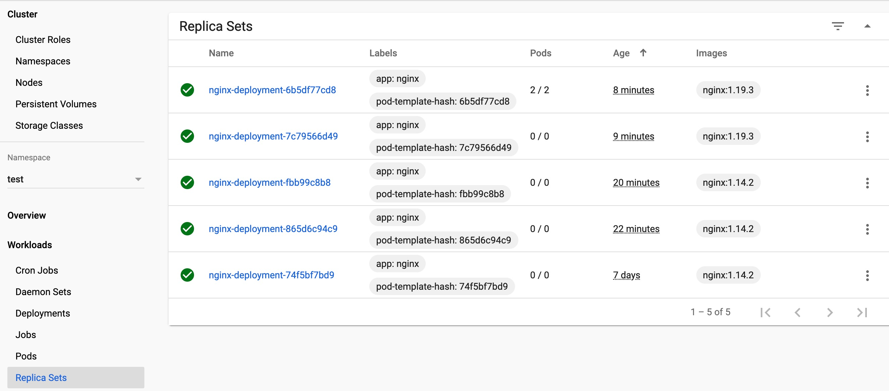
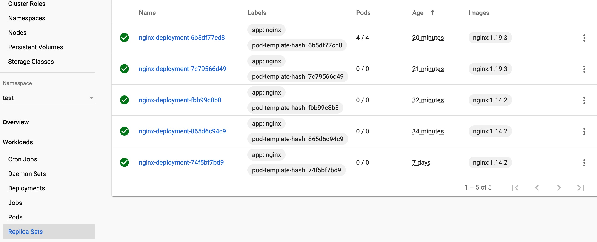

# 一拳搞定 Kubernetes | 走近 deployment

本文介绍通过 Kubernetes Deployment 对象如何去运行一个应用.

<!--more-->

## 一、学习目标
- 创建一个 nginx deployment.
- 使用 kubectl 列举关于 deployment 信息.
- 更新 deployment.
- 使用 go 客户端进行上述操作.

> 默认已经安装了 kubernetes. 如果没安装，请参考

## 二、命令操作

### 2.1 准备 yaml 文件

按照任务创建一个运行 nginx:1.7.9 Docker 镜像的 Deployment:

```yaml
apiVersion: apps/v1 # for versions before 1.9.0 use apps/v1beta2
kind: Deployment
metadata:
  name: nginx-deployment
  namespace: test
spec:
  selector:
    matchLabels:
      app: nginx
  replicas: 2 # tells deployment to run 2 pods matching the template
  template:
    metadata:
      labels:
        app: nginx
    spec:
      containers:
      - name: nginx
        image: nginx:1.14.2
        ports:
        - containerPort: 80
```

### 2.2 创建 Deployment

运行 Yaml 文件创建:

```bash
kubectl apply -f /XXX/document/note/Kubernetes/test/nginx/deployment.yaml
```

展示 Deployment 的信息:

```bash
kubectl describe deployment nginx-deployment --namespace=test

Name:                   nginx-deployment
Namespace:              test
CreationTimestamp:      Thu, 01 Oct 2020 17:12:59 +0800
Labels:                 <none>
Annotations:            deployment.kubernetes.io/revision: 3
                        kubectl.kubernetes.io/last-applied-configuration:
                          {"apiVersion":"apps/v1","kind":"Deployment","metadata":{"annotations":{},"name":"nginx-deployment","namespace":"test"},"spec":{"replicas":...
Selector:               app=nginx
Replicas:               2 desired | 2 updated | 2 total | 2 available | 0 unavailable
StrategyType:           RollingUpdate
MinReadySeconds:        0
RollingUpdateStrategy:  25% max unavailable, 25% max surge
Pod Template:
  Labels:  app=nginx
  Containers:
   nginx:
    Image:      nginx:1.14.2
    Port:       80/TCP
    Host Port:  0/TCP
    Limits:
      memory:  200Mi
    Requests:
      memory:     100Mi
    Environment:  <none>
    Mounts:       <none>
  Volumes:        <none>
Conditions:
  Type           Status  Reason
  ----           ------  ------
  Available      True    MinimumReplicasAvailable
  Progressing    True    NewReplicaSetAvailable
OldReplicaSets:  <none>
NewReplicaSet:   nginx-deployment-fbb99c8b8 (2/2 replicas created)
Events:
  Type    Reason             Age    From                   Message
  ----    ------             ----   ----                   -------
  Normal  ScalingReplicaSet  5m6s   deployment-controller  Scaled up replica set nginx-deployment-865d6c94c9 to 1
  Normal  ScalingReplicaSet  3m43s  deployment-controller  Scaled down replica set nginx-deployment-74f5bf7bd9 to 1
  Normal  ScalingReplicaSet  3m43s  deployment-controller  Scaled up replica set nginx-deployment-fbb99c8b8 to 1
  Normal  ScalingReplicaSet  3m41s  deployment-controller  Scaled down replica set nginx-deployment-865d6c94c9 to 0
  Normal  ScalingReplicaSet  3m41s  deployment-controller  Scaled up replica set nginx-deployment-fbb99c8b8 to 2
  Normal  ScalingReplicaSet  3m38s  deployment-controller  Scaled down replica set nginx-deployment-74f5bf7bd9 to 0
```

列出创建的 pods:

```bash
kubectl get pods -l app=nginx --namespace=

NAME                               READY   STATUS    RESTARTS   AGE
nginx-deployment-fbb99c8b8-4lpwd   1/1     Running   0          5m28s
nginx-deployment-fbb99c8b8-tpd4n   1/1     Running   0          5m26s
```

查看具体某个 pod 的信息:

```bash
kubectl describe pod nginx-deployment-fbb99c8b8-4lpwd --namespace=test

Name:         nginx-deployment-fbb99c8b8-4lpwd
Namespace:    test
Priority:     0
Node:         minikube/192.168.64.3
Start Time:   Fri, 09 Oct 2020 15:40:15 +0800
Labels:       app=nginx
              pod-template-hash=fbb99c8b8
Annotations:  <none>
Status:       Running
IP:           172.17.0.9
IPs:
  IP:           172.17.0.9
Controlled By:  ReplicaSet/nginx-deployment-fbb99c8b8
Containers:
  nginx:
    Container ID:   docker://16da80166234e8f7fdbb2e2bb7accbcc1841213cb2888af6463102675414c00d
    Image:          nginx:1.14.2
    Image ID:       docker-pullable://nginx@sha256:f7988fb6c02e0ce69257d9bd9cf37ae20a60f1df7563c3a2a6abe24160306b8d
    Port:           80/TCP
    Host Port:      0/TCP
    State:          Running
      Started:      Fri, 09 Oct 2020 15:40:16 +0800
    Ready:          True
    Restart Count:  0
    Limits:
      memory:  200Mi
    Requests:
      memory:     100Mi
    Environment:  <none>
    Mounts:
      /var/run/secrets/kubernetes.io/serviceaccount from default-token-pvdh5 (ro)
Conditions:
  Type              Status
  Initialized       True
  Ready             True
  ContainersReady   True
  PodScheduled      True
Volumes:
  default-token-pvdh5:
    Type:        Secret (a volume populated by a Secret)
    SecretName:  default-token-pvdh5
    Optional:    false
QoS Class:       Burstable
Node-Selectors:  <none>
Tolerations:     node.kubernetes.io/not-ready:NoExecute for 300s
                 node.kubernetes.io/unreachable:NoExecute for 300s
Events:
  Type    Reason     Age        From               Message
  ----    ------     ----       ----               -------
  Normal  Scheduled  <unknown>  default-scheduler  Successfully assigned test/nginx-deployment-fbb99c8b8-4lpwd to minikube
  Normal  Pulled     6m31s      kubelet, minikube  Container image "nginx:1.14.2" already present on machine
  Normal  Created    6m31s      kubelet, minikube  Created container nginx
  Normal  Started    6m31s      kubelet, minikube  Started container nginx
```

### 2.3 更新 deployment

更新镜像，把 nginx 从 1.14.2 升级到 1.19.3

```yaml
apiVersion: apps/v1 # for versions before 1.9.0 use apps/v1beta2
kind: Deployment
metadata:
  name: nginx-deployment
  namespace: test
spec:
  selector:
    matchLabels:
      app: nginx
  replicas: 2 # tells deployment to run 2 pods matching the template
  template:
    metadata:
      labels:
        app: nginx
    spec:
      containers:
      - name: nginx
        image: nginx:1.19.3
        ports:
        - containerPort: 80
```

应用yaml文件和创建一样.

查看新的 pods:

```bash
kubectl get pods -l app=nginx --namespace=test

NAME                                READY   STATUS    RESTARTS   AGE
nginx-deployment-6b5df77cd8-lf2cl   1/1     Running   0          69s
nginx-deployment-6b5df77cd8-n52z6   1/1     Running   0          71s
```

可以看到和之前的名称都是不一样的.

### 2.4 改变副本数来弹性伸缩应用

关键参数 `replicas` 可以设置 pod 的数量，下面例子把 nginx 变成 4 个:

```yaml
apiVersion: apps/v1 # for versions before 1.9.0 use apps/v1beta2
kind: Deployment
metadata:
  name: nginx-deployment
  namespace: test
spec:
  selector:
    matchLabels:
      app: nginx
  replicas: 4 # tells deployment to run 2 pods matching the template
  template:
    metadata:
      labels:
        app: nginx
    spec:
      containers:
      - name: nginx
        image: nginx:1.19.3
        ports:
        - containerPort: 80
```

应用yaml文件和创建一样.

查看新的 pods:

```bash
kubectl get pods -l app=nginx --namespace=test

NAME                                READY   STATUS    RESTARTS   AGE
nginx-deployment-6b5df77cd8-5b28p   1/1     Running   0          65s
nginx-deployment-6b5df77cd8-b24xd   1/1     Running   0          65s
nginx-deployment-6b5df77cd8-lf2cl   1/1     Running   0          17m
nginx-deployment-6b5df77cd8-n52z6   1/1     Running   0          17m
```

dashboard可以直观看到:


### 2.5 删除 deployment

通过名称删除deployment:

```bash
kubectl delete deployment nginx-deployment --namespace=test
```

## 三、API操作

## 四、补充信息

### 3.1 ReplicaSet

首先可以看到 nginx 的变化如下图:



扩容到四个节点后:



## 五、参考

https://kubernetes.io/zh/docs/tasks/run-application/run-stateless-application-deployment/

https://kubernetes.io/zh/docs/concepts/workloads/controllers/deployment/

https://kubernetes.io/zh/docs/tasks/administer-cluster/access-cluster-api/

https://github.com/kubernetes/client-go

